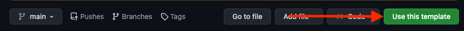
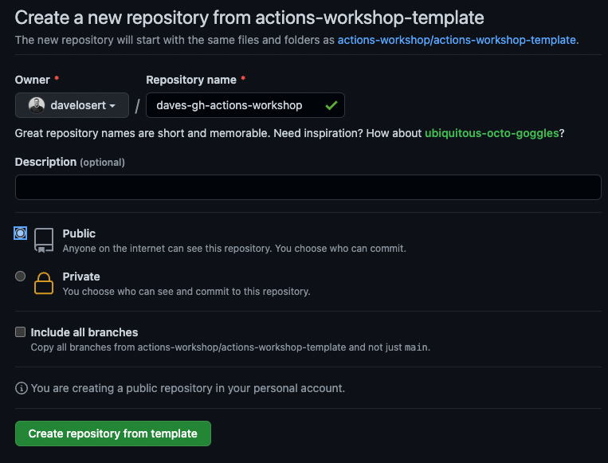

# GitHub Actions Workshop by GitHub

> *Lift-off with GitHub Actions - it's not rocket-science (unless you use it for rockets).* 🚀

Welcome to our GitHub Actions Workshop! It will teach you all the basics of GitHub Actions and beyond, so that you feel confident in automating your own workflows and deployments.

Our goal is to make GitHub Actions as easy to you as floating in space!


Following this workshop, you will create a set of GitHub Action workflows in order to **test, release, secure** and **deploy** the **Rocketdex** 🚀 - an awesome React-Application that lets you view and collect all your favorite rockets!

You will learn how to

- run your **first GitHub Action**
- use [**the Marketplace**](https://github.com/marketplace)
- create a complete and secure **CI pipeline** from scratch
- deploy your application to [Microsoft Azure](https://azure.com/) (or another Cloud Provider of your choice)

## Getting Started 🚀

Anything you need for this workshop is contained within this template-repository - so the first thing you need to do is get a copy of it:

1. On the top right, click the green `Use this template` button
    
2. Give your new repository any name you like (for example `<your-name>-gh-actions-workshop`)
3. Decide for an owner of the new repository (when in doubt, use your private GitHub account)
4. Make it a `Public` repository so you don't use up any of your private action minutes
5. Click `Create repository from template`



In your own repository, you now can safely create and change all files and run actions workflows according to the instructions shared by your trainer or by following our [self-serve documents](#workshop-parts-) below.

## Workshop Parts 📚

These are the self-serve documents you can follow to complete this workshop. If you are doing this with a trainer, these are your reference materials:

1. **[Hello World - Run your first Action](./docs/001-hello-world.md)**
2. **[Basics of Continous Integration - Build & Test](./docs/002-basics-of-ci-with-actions.md)**
3. **[Package and release your Application](./docs/003-packaging.md)**
4. **[Security with Actions](./docs/004-security.md)**
5. **[Lift-off - Deployment with Actions](./docs/005-deployment.md)**

## Rocketdex  Application Setup

The **Rocketdex** application is a [React](https://reactjs.org/)-Application build with [vite](https://vitejs.dev/) and tested with [vitest](https://vitest.dev/).

You can simply clone it and install all dependencies using:

```sh
npm install
```

After that, you can start it in development mode to have a look at it:

```sh
npm run dev
```

### Other useful commands

| Description                                               | Command         |
| --------------------------------------------------------- | --------------- |
| Build and Bundle the App using [vite](https://vitejs.dev) | `npm run build` |
| Run Unit Tests with [vitest](https://vitest.dev/)         | `npm run test`  |
| Lint the Code with [ESLint](https://eslint.org/)          | `npm run lint`  |

## Contributions

Please see [CONTRIBUTING.md](./CONTRIBUTING.md) for details.

## Licensing

This repo is licensed under MIT for code and CC BY-SA 4.0 for documentation (`docs/` folder and the `README.md.`). See the [LICENSE](./LICENSE) File for more information.
