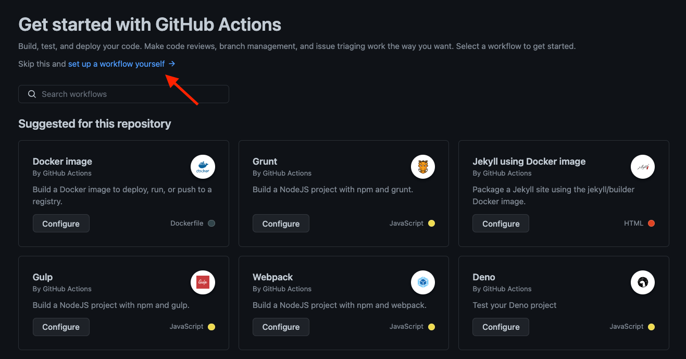
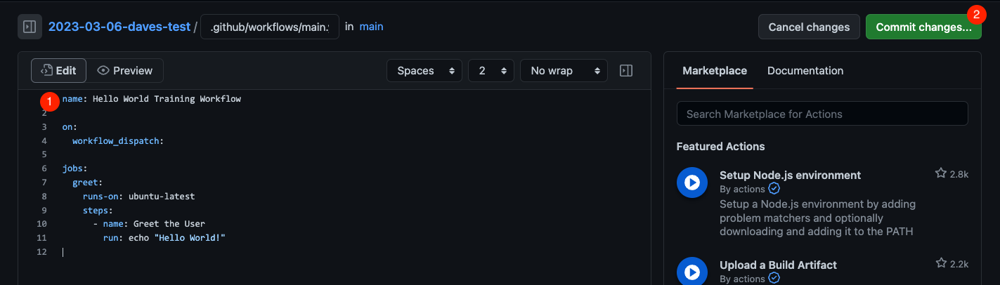
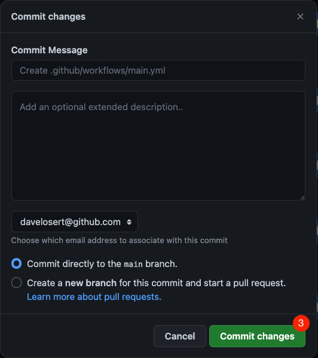

# Part 1 - Hello World

GitHub Actions is a continuous integration and continuous deployment (CI/CD) platform that allows you to automate your build, test, and deployment pipelines. It gives you the ability to create workflows that build and test every pull request to your repository, and then later automatically deploy merged pull requests to production.

GitHub Actions also supercharges DevOps by allowing you to run workflows triggered by a large number of different events in your repository. As an example, you can build a workflow which automatically adds the appropriate labels (e.g. "bug" or "triage") whenever someone creates a new issue in your repository.

GitHub provides Linux, Windows, and macOS virtual machines to run your workflows, or you can host your own self-hosted runners in your own data center or cloud infrastructure.

**The components of GitHub Actions**

GitHub Actions workflows are always triggered by events occurring in your repository such as a pull request being opened or an issue being created. A workflow contains one or more jobs which can run in sequential order or in parallel. Each job will run inside its own virtual machine runner, or inside a container, and has one or more steps. Each step executes either a shell script or an action, which is a reusable extension that automates a certain piece of your workflow.


You can read more about [GitHub Actions and workflows components](https://docs.github.com/en/actions/learn-github-actions/understanding-github-actions#the-components-of-github-actions) in the official documentation.

## 1 - Implement your first workflow with GitHub Actions

### 1.1 - Create a "Hello World" workflow

Enough talking. Let's create our very first, own GitHub Actions workflow!

1. In your repository, click on the **Actions** tab. You will be offered a list of workflow suggestions. For your first workflow, however, you need to click the **set up a workflow yourself** link at the top of the page

  

2. This will automatically bring you to GitHub Web GUI Action Editor, which wants to create a new file in your repository under `.github/workflows/main.yml`. Paste the following content into it:

    ```yml
    name: Hello World Training Workflow

    on:
      workflow_dispatch:

    jobs:
      greet:
        runs-on: ubuntu-latest
        steps:
          - name: Greet the User
            run: echo "Hello World!"
    ```

    

3. Click on `Commit changes` and then commit it directly to the `main` branch (we won't tell anyone 🤫)

    

Rename the file to `hello.yml`, click **Start Commit** and commit it directly to the `main` branch .

### 1.2 - Run the workflow manually

The workflow you created is triggered by the `workflow_dispatch` event, meaning it can be manually executed:

```yml
on:
  ...
  # Allows you to run this workflow manually from the Actions tab
  workflow_dispatch:
```

You can manually execute your workflow by going to the **Actions** tab, then selecting your workflow and clicking on the **Run workflow** button:


Refresh the page or wait a few seconds to see the results of your workflow run.


Congratulations, you've just run your first GitHub Action worklfow. 🥳

> **About workflow triggers**
>
> Your workflows are only triggered by the events you specify. For more information, see "[Configuring a workflow](https://docs.github.com/en/actions/using-workflows)" and "[Workflow syntax for GitHub Actions](https://docs.github.com/en/actions/using-workflows/workflow-syntax-for-github-actions)". We will learn more about this in a bit.

## 1.3 - Analyze your workflow

In the list of workflow runs, click on one of the runs for the "Hello World" workflow. You will be shown its single job (`greet`) under "Jobs" on the left side the page. Click on that job to see its logs (you can expand the logs for a certain step by clicking on it).

The workflow run view also allows you to re-run jobs in case problems occurred (button on the top right). Re-running a job also allows [enabling debug logging](https://docs.github.com/en/actions/monitoring-and-troubleshooting-workflows/enabling-debug-logging).

## 2 - Use an Action

Using bash commands to automate things is a basic requirement for any CI/CD System. However, writing shell scripts becomes very cumbersome if you want to scale up, and you tend to rewrite the same functionality in different projects over and over again.

Luckily, with GitHub Actions there is a far better way of doing things: Using **Actions**! An **Action** is a small, composable and reusable unit of automation-code that can be easily used in all of your workflows.

### 2.1 - Add an Action to your workflow

Let's just go ahead and use the most basic and yet common one to get an understanding: The `actions/checkout` action:

1. In your Editor, navigate to the `Code` Tab, then to `.github/workflows/hello.yml` and then hit the little pencil on the top right to reopen the actions editor.
2. Add the following steps to the existing job:

    ```yml
    steps:
      - name: Greet the User
        run: echo "Hello World!" 
      # LS will simply list all files in the current directory to compare before and after
      - run: ls -l
      - uses: actions/checkout@v2
      - run: ls -l
    ```

    Note that, other than when running shell, running an action requires the usage of the `use` keyword.

3. Commit the changes, trigger a new workflow run

### 2.2 - Understand the power of Actions

If you check the workflow-logs and compare the output of the two `ls -l` commands, you will see that the `actions/checkout` Action has checked out the `main` branch of our repository onto the runner. And it did so without you having to specify any `git clone` shell command or any references or configuration.

And this is only the beginning. There are thousand of even more sophisticated actions ready for you to use that will make very complex automations a matter of a few lines of configuration. And we will see a lot of this over the course of this workshop.

But if you already want to take a glimpse on all the existing Actions created not only by GitHub, but the entire OSS Community, head over to our [GitHub Marketplace](https://github.com/marketplace?category=&query=&type=actions&verification=).

## 3 - Use Environment variables and context

You can use environment variables to add information that you would like to reference in your workflows. Some environment variable are even predefined for you to be ready to use (e.g. the person who triggered the current workflow run). To achieve that, edit the "Hello World" workflow and add the following lines:

1. Add an environment variable at the job level

    ```yml
        greet:
            env:
                MY_ENV: "John Doe"
    ```

2. Add a second step to use your environment variable and a default one

    ```yml
          - name: Run a multi-line script
            run: |
              echo "Hello $MY_ENV"
              echo "Hello $GITHUB_ACTOR"
    ```

<details>
<summary>You workflow file (main.yml) should now look like this:</summary>

```yml
name: Hello World Training Workflow

on:
  workflow_dispatch:

jobs:
  greet:
    env:
        MY_ENV: "John Doe"
    runs-on: ubuntu-latest
    steps:
      - name: Greet the User
        run: echo "Hello World!"
      - name: Run a multi-line script
        run: |
          echo "Hello $MY_ENV"
          echo "Hello $GITHUB_ACTOR"
```

</details>

Commit your changes and start a new run. You should see the following in the run logs (whereas the second `Hello` should be printing your own GitHub username):


To learn more about environment variables and default variables, see [the official GitHub Documentation on Environment-Variables](https://docs.github.com/en/actions/learn-github-actions/environment-variables).

## 4 - Make more events trigger your workflow

GitHub Actions workflows can be triggered by many different types of events:

- [Events that trigger workflows](https://docs.github.com/en/actions/using-workflows/events-that-trigger-workflows)

Let's change our workflow to make it also run automatically whenever an issue is created in our repository (this is commonly called "IssueOps"). For that, add the following in the `on` section of the workflow file and commit the changes:

```yml
...

on:
  workflow_dispatch:
  issues:
    types: [opened, edited]

...
```

Now create an issue in your repository and check the Actions tab. You should see the following workflow run:


## Conclusion

In this first part of the Actions workshop, you have learned how to:

- 👏 Create a new Actions workflow for automation.
- 👏 Analyze your workflow runs and get insights into what happened.
- 👏 Used our first reusable Action.
- 👏 Run automation on different events - manual trigger and issue.

Let's now use GitHub Actions to create a CI/CD workflow for our application.

---

Next :

- **[Basics of Continuous Integration with Actions](002-basics-of-ci-with-actions.md)**
