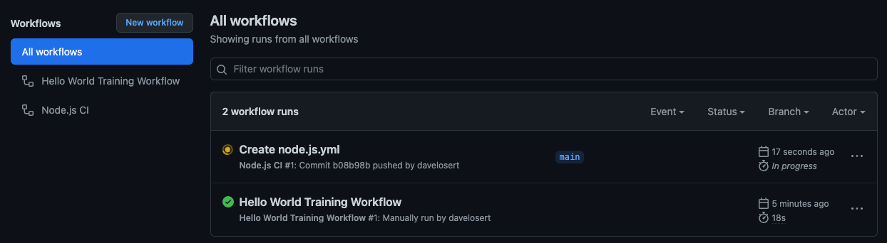
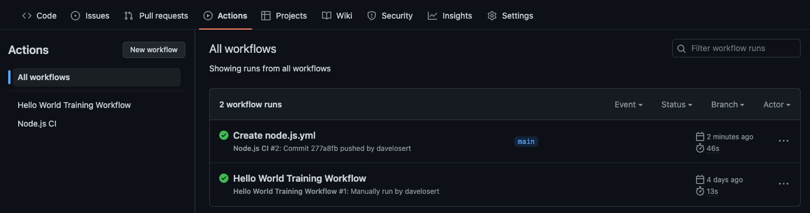
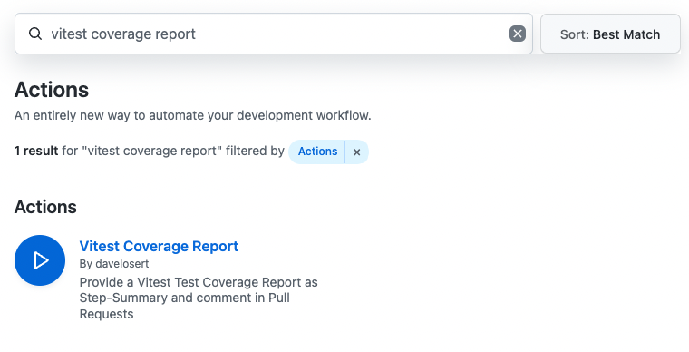
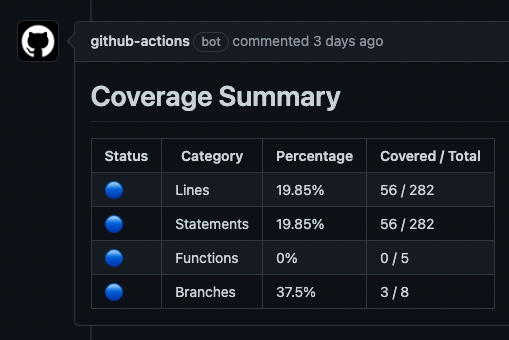
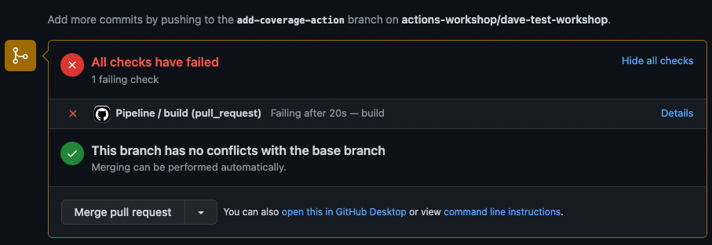
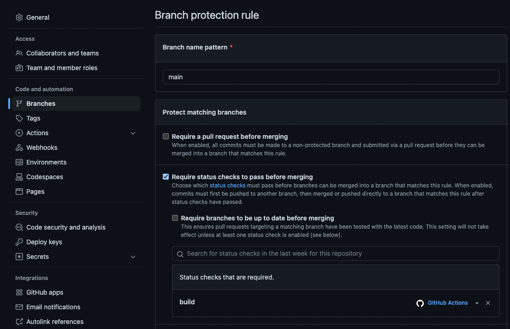
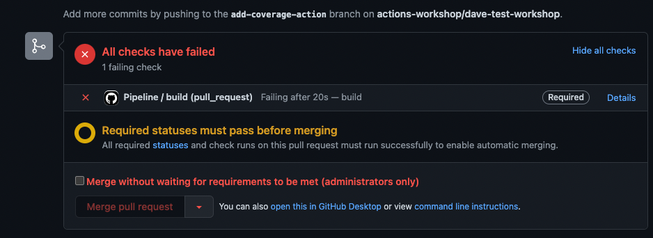

# Part 2 - Basics of CI with Actions

## 1 - Inspect the repository

This repository contains a [React](https://reactjs.org/)-based application built with [Vite](https://vitejs.dev/). We aim to automate its testing and building in this lab.

Feel free to explore the files if you're curious about the app's operation (though it's not strictly necessary for understanding the remainder of the workshop).

- [`src/main.tsx`](../src/main.ts) : This is the main entry point of the application.
- [`src/pages/Home.tsx`](../src/pages/Home.tsx) : This route contains most of what you will see upon launching the application.
- [`src/pages/Home.test.ts`](../src/pages/Home.test.tsx) : Here, you will find [`vitest`](https://vitest.dev/) tests that we will run with GitHub Actions.
- [`Dockerfile`](../Dockerfile) : This Docker file packages the application into a container that will be used later in this workshop.

If you want to test the application, you can start a Codespace and run it with the command `npm run dev`
(you can also run the tests with `npm test`). To run the application on your local machine, you will need to install Node.js first.

To test the container, run `docker build . -t local:latest` to build the image and `docker run -p 8080:8080 local:latest` to run it. These commands require a local installation of [Docker](https://www.docker.com/).

## 2 - Implement Continuous Integration (CI)

### 2.1 - Use a starter workflow

To build a workflow that employs Actions for your Continuous Integration process, start by adding a **starter workflow** to your repository:

1. From your repository's main view, find and navigate to the **Actions** tab.
2. Select **New workflow**.
3. Search for `Node.js`.
4. Click **Configure** under the `Node.js` starter workflow.
5. In the `node-version` field within the YAML configuration, remove `14.x` (since our app isn't compatible with this version).

To finish setting up your initial CI workflow, commit the `node.js.yml` file to the `main` branch.

<details>
<summary>Your `.github/workflows/node.js.yml` should contain the following:</summary>

```yml
name: Node.js CI

on:
  push:
    branches: [ main ]
  pull_request:
    branches: [ main ]

jobs:
  build:
    runs-on: ubuntu-latest

    strategy:
      matrix:
        node-version: [16.x, 18.x]
        # See supported Node.js release schedule at https://nodejs.org/en/about/releases/

    steps:
      - uses: actions/checkout@v3
      - name: Use Node.js ${{ matrix.node-version }}
        uses: actions/setup-node@v3
        with:
          node-version: ${{ matrix.node-version }}
          cache: 'npm'
      - run: npm ci
      - run: npm run build --if-present
      - run: npm test
```

</details>

### 2.2 - Understanding references to actions

As you can see, we're now employing a second action in our workflow, `actions/setup-node`, which is used to install a specific Node.js version on the runner.

Let's dissect the reference to that action to understand its structure:

- `actions/` references the owner of the action, which is translated into a user or organization on GitHub.
- `setup-node` refers to the name of the action, which corresponds to a repository on GitHub.
- `@v3` represents the version of the action, which corresponds to a Git tag or a general reference (such as a branch or even a commit SHA) on the repository.

This reference structure makes it straightforward to navigate to the source code of any action by merely appending the `owner` and `name` to the `github.com` URL, like so: `https://github.com/{owner}/{name}`. For the above example, this would be <https://github.com/actions/setup-node>.

### 2.3 - Understanding matrix builds

Observe that our workflow employs a [matrix build strategy](https://docs.github.com/en/actions/using-jobs/using-a-matrix-for-your-jobs) with two Node.js versions: 16 and 18. A matrix build enables you to execute a job in parallel using various input parameters. In our case, we're running the same job twice, but with distinct Node.js versions.

### Checking workflow runs

Your newly implemented CI workflow now runs with every push. Given that you just pushed a new commit containing the workflow you've created, you should already have a workflow run in progress.



Keep in mind that we will need to run tests as part of our CI workflow. You can find most of this application's tests in the [`src/pages/Home.test.tsx`](../src/pages/Home.test.tsx) file, which partly looks like this:

```typescript
// ... imports

describe("<Home />", (): void => {
  afterEach((): void => {
    cleanup();
  });

  it("renders the octocats returned from the API.", async (): Promise<void> => {
    const inMemoryAPI = createInMemoryOctocatApi();
    inMemoryAPI.addOctocats([
      createTestOctocat({ id: "#1", name: "Octocat 1" }),
      createTestOctocat({ id: "#2", name: "Octocat 2" }),
    ]);

    renderWithProviders({ component: <Home />, inMemoryApi: inMemoryAPI });

    expect(await screen.findByText("Octocat 1")).toBeDefined();
    expect(screen.getByText("Octocat 2")).toBeDefined();
  });

  // ... more tests

});

```

The result of your last push to the main branch should resemble the following:



## 3 - Add code coverage to your workflow

When setting up CI for your project, it's common to provide additional information to users, such as code coverage stats for the project's tests.

Doing that is straightforward with GitHub Actions. You determine where and when a specific task should occur, and then search for an appropriate action in the [GitHub Marketplace](https://github.com/marketplace?category=&query=&type=actions&verification=).

### 3.1 - Find an action in the marketplace

1. Search for an Action in the GitHub Marketplace:  `vitest coverage report`
  

2. Click on the **Vitest Coverage Report** action.

3. Read the provided documentation and incorporate the action into your workflow.

### 3.2 - Permissions in a workflow

This is a good moment to discuss **permissions** within a workflow. Any workflow interacting with GitHub resources requires permissions to do so. By managing permissions, GitHub users can ensure that only authorized users or processes can carry out specific actions, like calling an API with a private access key, executing certain automations, or deploying to production environments. This prevents unauthorized access to sensitive data, reduces the risk of unintentional or malicious changes, and helps to uphold the overall security and stability of the codebase. For example:

1. The `actions/checkout` action requires read permissions for your repository to execute the checkout on the runner machine.
2. The **Vitest Coverage Report** action needs to write a comment to a pull request, and thus needs permissions to do so.

By default, GitHub Actions workflows are executed with a restricted [set of default permissions](https://docs.github.com/en/actions/security-guides/automatic-token-authentication#permissions-for-the-github_token), which can be extended as needed with the `permissions` keyword. This can be applied:

- At the root of the workflow to set this permission for **all** jobs within the workflow.
- Within a [job](https://docs.github.com/en/actions/using-jobs) definition itself to specify permissions for that job only. This approach is recommended from a security perspective, as it provides the least required privileges to your workflows and jobs.

These permissions are applied to the `GITHUB_TOKEN`, which we will explore in more detail later.

For now, what you need to know is: as soon as you specify the `permissions` keyword, the default permissions no longer apply. This means you must explicitly configure all necessary permissions in the job or workflow. Let's do this in the next step.

### 3.3 - Update the worklow

1. In the `main` branch, edit the CI workflow `.github/workflows/node.js.yml`

2. Add the `permissions` keyword with the following permissions into the job section:

    ```yml
    build:
      runs-on: ubuntu-latest
      permissions:
        # Required to allow actions/checkout to clone the repository onto the runner
        contents: read
        # Required to allow the vitest coverage action to write a comment into the pull request
        pull-requests: write
      # ... rest of the node.js.yml
    ```

3. Add the following step in the `build` job section of your workflow, right after the `npm test` step:

    ```yml
        # ... rest of the node.js.yml
        - run: npm run test
        - uses: davelosert/vitest-coverage-report-action@v1
          with:
            vite-config-path: vite.config.ts
    ```

4. While you're at it, how about giving the job a better `name`?

    ```yml
      jobs:
        build:
          name: "Build and Test"
          runs-on: ubuntu-latest
      # ... rest of the node.js.yml
    ```

5. Commit the `node.js.yml` file.

### 3.4 - Remove the matrix build strategy

As this is a frontend project, we don't need a matrix build strategy (which is more suited for backend projects that might be running on several Node.js versions). Removing the matrix build will also make the tests run only once.

<details>
<summary>Try to remove the matrix build yourself and make the `actions/setup-node` action only run on version 16.x. Expand this section to see the solution.</summary>

```yml
jobs:
  build:
    name: "Build and Test"
    runs-on: ubuntu-latest
    permissions:
      contents: read
      pull-requests: write
    steps:
      - uses: actions/checkout@v3
      - name: Use Node.js
        uses: actions/setup-node@v3
        with:
          node-version: 16.x
          cache: 'npm'
      - run: npm ci
      - run: npm run build
      - run: npm run test
      - name: 'Report Coverage'
        uses:  davelosert/vitest-coverage-report-action@v2
```

</details>

### 3.5 - Create a new pull request

1. Go to the main page of the repository.

2. Click on [`./src/main.tsx`](../src/main.tsx), and edit the file (for instance, add a comment).

3. Scroll down and click **Create a new branch for this commit and start a pull request**.

4. Click **Propose changes**.

5. Click **Create pull request**.

6. Wait for the CI workflow to run, and you will see a new comment in your pull request with the code coverage.


### 3.6. (Optional) - Enforce a certain coverage threshold with Branch Protection rules

As you can see, the test coverage of this project is quite low. Sometimes, we want to enforce a certain level of coverage on a project. This means that we would not allow merging a PR if it reduces the coverage below a certain threshold.

Let's try that out in this project:

1. On the branch you created earlier, navigate to the [`vite.config.ts`](../vite.config.ts) file (located at the root level of the repository). Within the `test.coverage` section, edit it to establish some thresholds like this:

    ```typescript
    coverage: {
      reporter: ["text", "json", "json-summary"],
      lines: 100,
      branches: 100,
      functions: 100,
      statements: 100
    },
    ```

2. With the coverage thresholds set, our workflow will now fail after the next commit on the `npm test` step. However, since we still want to report the coverage, we need to run the `vitest-coverage-report-action` even if the previous step fails. We can do this by adding an `if: always()` statement to the step:

      ```yml
      - name: 'Report Coverage'
        uses:  davelosert/vitest-coverage-report-action@v2
        if: always()
      ```

3. Commit the changes and wait for the workflow to run.

The `coverage` step should now fail. However, this does not yet prevent you from merging this PR. The merge button is still clickable:



To make this work, we need to set our target branch `main` as a protected branch and enforce that the `build` workflow be successful before a merge can be executed:

1. Within your repository, go to **Settings** and then to **Branches**.

2. Under **Branch protection rules**, click on **Add branch protection rule**.

3. For the **Branch name pattern**, type `main`.

4. Check the **Require status checks to pass before merging** box.

5. In the search box that will appear, look for `Build and Test` (or whatever name you chose for the job in step 3.3) and select that job. *(Note that you might also see the jobs of the previous matrix builds with specific Node versions. You can ignore these.)*
    

6. Scroll down and click `Create`.

If you now return to the PR, you will see that the merge button is inactive and can't be clicked anymore.



As an administrator, you still have the option to force a merge. Regular users in your repo won't have this privilege.

> **Note**
> This will now prevent people from merging a branch to `main` not only if the coverage thresholds are not met, but also if the entire workflow fails for other reasons. For example, if the build isn't working anymore or if the tests are generally failing - which usually is a desired outcome.

From here, you have two options:

1. Write more tests (if you're into React 😉)
2. Remove the (admittedly stringent) thresholds or lower them to make the workflow pass

## Conclusion

In this lab, you have learned how to:

- 👍 Add a new workflow for CI.
- 👍 Search for an action in the GitHub Marketplace.
- 👍 Use the `permissions` directive.
- 👍 Add a new action to your workflow.
- 👍 (optionally) Prevent merges on failing tests or coverage thresholds using Branch Protection rules.

---

Next:

- **[Packaging](003-packaging.md)**
