# Part 4 - Security

In the previous lab, you have packaged your Application and you are now almost ready for deployment. But first we need to make sure to not introduce any security risks to our production infrastructure with our changes!

After all, Nasa wouldn't launch a rocket without making sure it is safe to do so, right?

Security is an integral part to building software. Too much is at stake, so it can not merely be an aferthought to what you do, but needs to be tightly integrated into your Software Development Lifecycle!

We need to be able to spot and fix vulnerabilities as soon as possible, and for this, **automation** plays a major role. Hence, enter the security stage: GitHub Actions!

In this lab, you will leverage GitHub Actions to improve security through automation by creating two new workflows:

1. **Supply-Chain Security**: You will use the [**Depency Review Action**](https://github.com/actions/dependency-review-action) to make sure you are not introducing vulnerable dependencies in your pull-requests. This is important as an average of 80% of code within your project will come from 3rd Party libraries, so we have to make sure they are secure before using them!
2. **Code-Security**: You will execute a **Static Code Analysis with CodeQL** to also make sure you are not introducing any vulnerabilities in the 20% that is still your own written code - after all, we are just rocket scientists, so we make mistakes!

> **Note**
> Both of these features are part of GitHub Advanced Security - or **GHAS** for short - which offers additional security features beyond the actions we are using in this workshop. It is free for public repositories and thus can be used in this workshop! For more information, see [About GitHub Advanced Security](https://docs.github.com/en/code-security/secure-coding/about-github-advanced-security).

## Preparation: Enable Dependency Graph and GitHub Advanced Security (GHAS)

In order to make both features work, we first need to prepare our repository by enabling the Dependency Graph and GitHub Advanced security:

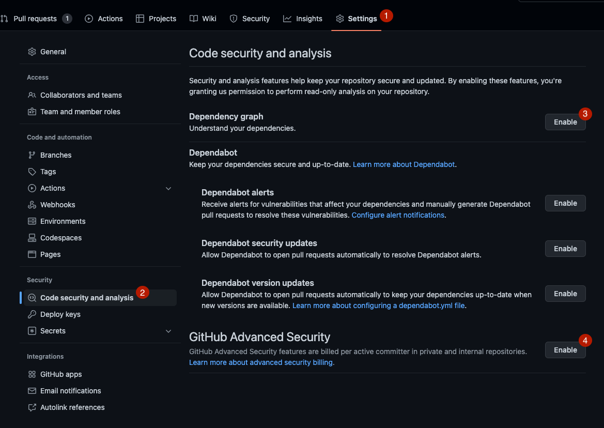

1. Go to your repository's settings
2. Select the **Code security and analysis** tab
3. Click **Enable** the **Dependency graph**
4. Click **Enable** for **GitHub Advanced Security** and confirm the activation by clicking **Enable GitHub Advanced Security for this repository**
  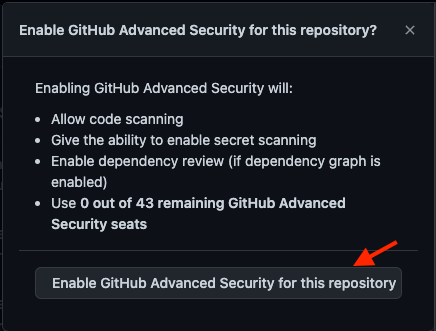

> **Note**
> You will only be able to enable GHAS in a public repository or in organizations where you have GHAS Licenses available.

## 1. Add the Dependency Review Action

By enabling the Dependency Graph, we allowed GitHub to analyze the [`package.json`](../package.json) and [`package-lock.json`](../package-lock.json) files in our repository to keep track of all contained dependencies.

You can check that this worked by navigating to **Insights** > **Dependency graph** in your repository:

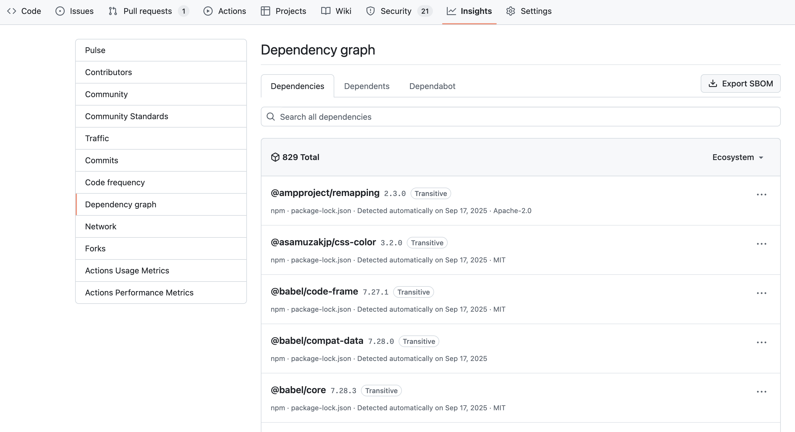

We can make use of this data with the [Dependency Review Action](https://github.com/actions/dependency-review-action), which will cross-reference new dependencies and versions with known vulnerabilities from our [GitHub Advisory Database](https://github.com/advisories).

### 1.1 - Add a Dependency Review workflow

1. Create a new workflow-file `.github/workflows/dependency-review.yml` with the following content:

    ```yml
    name: 'Dependency Review'
    on: [pull_request]

    permissions:
      contents: read
      pull-requests: write

    jobs:
      dependency-review:
        runs-on: ubuntu-latest
        steps:
          - name: 'Checkout Repository'
            uses: actions/checkout@v3
          - name: 'Dependency Review'
            uses: actions/dependency-review-action@v3
            with:
              comment-summary-in-pr: true
    ```

2. Commit this file to your `main` Branch

### 1.2 - Make sure it works

Now lets test if this actually works. We need to install a new dependency, so you will have to do the following actions in a checked-out repository on your local machine or from within a GitHub Codespace:

1. Open up a Terminal
2. Create a new branch `add-vulnerability`

    ```bash
    git checkout -b add-vulnerability
    ```

3. Install `lodash` in version `4.17.20` which is known to be vulnerable:

    ```bash
    npm install lodash@4.17.20
    ```

4. This will adjust both, the `package.json` and the `package-lock.json` - so let's commit these changes and push our branch to GitHub:

    ```bash
    git add package.json package-lock.json
    git commit -m "Add vulnerable dependency"
    git push -u origin add-vulnerability
    ```

5. Open a pull-request for your branch<br/>
    *If you don't know how to open a pull request, you can pick your favorite way and follow allong with our [docs on Creating a pull request](https://docs.github.com/en/pull-requests/collaborating-with-pull-requests/proposing-changes-to-your-work-with-pull-requests/creating-a-pull-request?tool=cli)*

6. By opening a pull-request, you will trigger the `Dependency Review` workflow - but it will fail due to the newly introduced vulnerability. As we have set the `comment-summary-in-pr` option to `true`, the action will conveniently comment on the pull-request with a summary of the vulnerabilities it found:
    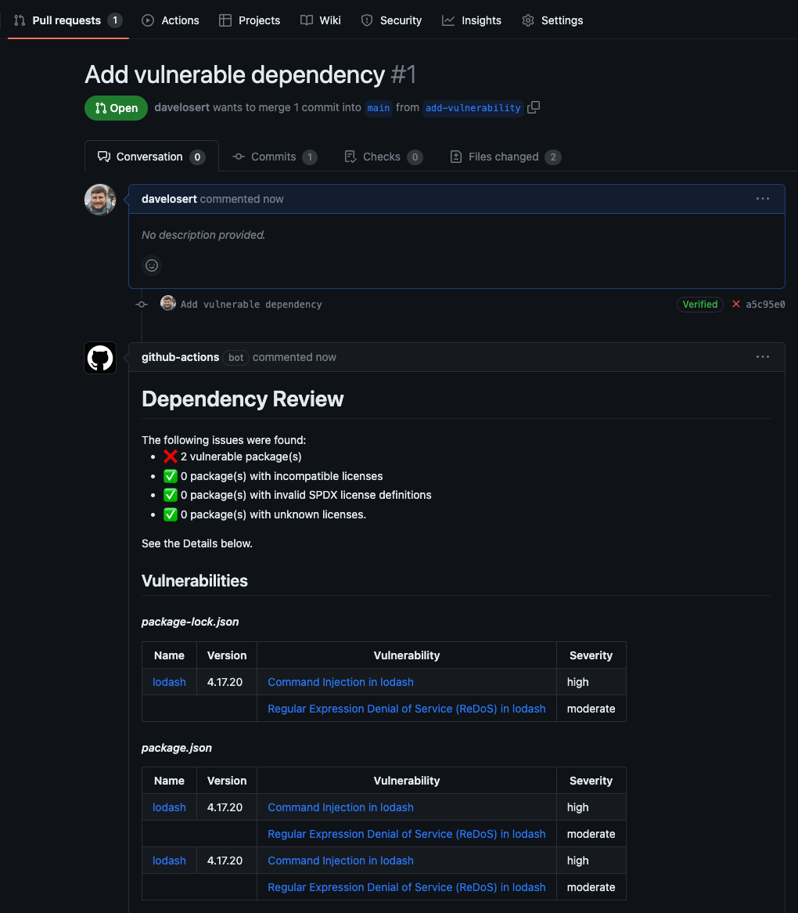
  
    Alternatively, you can also view the summary in the workflow-run's dashboard by clicking on the **Details** link next to the failed check and then navigate to the workflows **Summary**:

    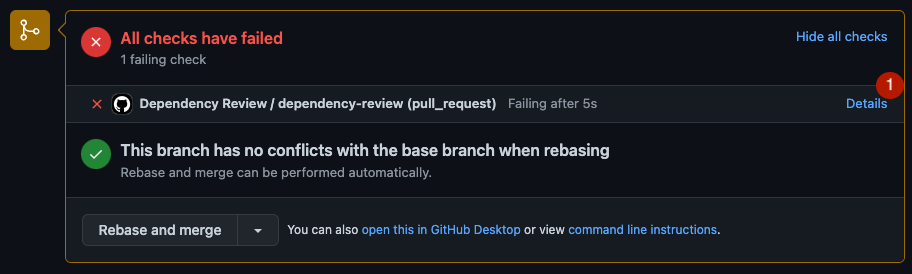

    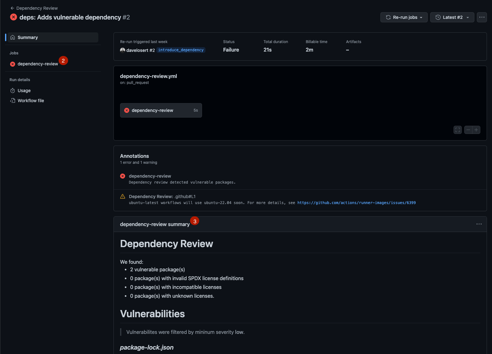

Inspect the Links in the summary - they will take you directly to the advisory on GitHub, where you can find more information about the vulnerability and how to fix it.

**You can try to fix the vulnerability by upgrading to the patched version of lodash. However, this is not required to continue with the workshop, so you can also just leave the pull request as it is as a reference for you!**

In the Dependency Review Action summary, you might also have seen something about licenses - if you are interested in that, you can read all about it and how to configure it in the [Dependency Review Action Readme](https://github.com/actions/dependency-review-action).

## 2. Add Code Scanning with CodeQL

Now let's add a second security feature to our repository: CodeQL. CodeQL is GitHub's Static Code Analysis tool - meaning can automatically scan your source code for possible insecure code snippets and vulnerabilities.

It does so by first loading your code into a database and then running a set of pre-defined queries against it. These queries are written in a custom query language called CodeQL and are stored in the official [CodeQL repository](https://github.com/github/codeql). This also means that, whenever new queries are added, you can automatically profit from them.

As **Actions** speak more than thousand words (pun intended), let's just go ahead and use it!

### 2.1 - Add a CodeQL workflow

In you repository, go again to **Actions > Setup new workflows**, scroll down to the **Security** Section until you see the **CodeQL Analysis** workflow and click on **Configure**:

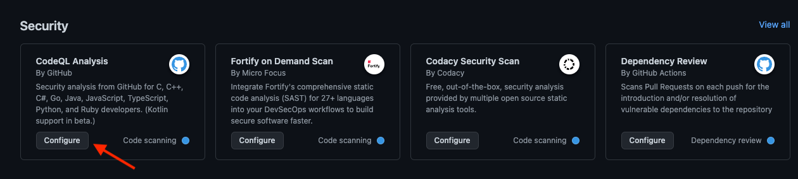

Let's examine the `.github/workflows/codeql.yml` file that is to be created and make some changes before we commit it.

1. We have several triggers in the `on:`-section, and you already know the `push` and the `pull-request` trigger from previous workflows. However, the `schedule` trigger is new:

    ```yml
    on:
      push:
        branches: [ "main" ]
      pull_request:
        branches: [ "main" ]
      schedule:
        - cron: '23 18 * * 1'
    ```

    As the name intends, this will trigger this workflow on a schedule, so recurringly at a specified time or interval. The `cron`-expression is a way to define the schedule in a human-readable way. In this case, it will run every Monday at 6:23 PM. You can read more about the syntax in the [GitHub Docs](https://docs.github.com/en/actions/using-workflows/events-that-trigger-workflows#schedule).

    Executing a Code-Scan once a week makes perfect sense, given that new queries might have been added to the CodeQL repositories which might show us vulnerabilities that were sleeping in our code.

    However, as this is a non-production application, and to save up on your precious Actions minutes, you can also just remove this trigger.

2. In the `strategy` section, we have another `matrix` defined, a keyword you already know:

     ```yml
    strategy:
      fail-fast: false
      matrix:
        language: [ 'javascript' ]
    ```

    But what about the `fail-fast`? On default, if one job of a matrix fails, the other jobs will be cancelled immediately to save Actions minutes. By setting `fail-fast` to `false`, we deactivate this behavior, so all jobs of the matrix will run until the end, even if one or more of them fail.

    This is useful for projects where you have more than one language. It's not the case here, but it also doesn't hurt to leave it in.

3. In the steps section, you find the `Initialize CodeQL` step, which will download the CodeQL CLI and initialize the CodeQL database by loading the code of our repository into it.

    ```yml
    - name: Initialize CodeQL
      uses: github/codeql-action/init@v2
      with:
        languages: ${{ matrix.language }}
    ```

4. The `Autobuild` step is actually only required for compiled languages like Java, C++, Go, as CodeQL needs the compilation scan to deliver better scan results. **However, as this is a JavaScript / Typescript app, it is not needed and you can safely remove that step!**

    ```yml
    - name: Autobuild
      uses: github/codeql-action/autobuild@v2
    ```

5. The `Perform CodeQL Analysis` step will then finally run the CodeQL queries against the database with our code and upload the results back to GitHub for you to explore.

    ```yml
    - name: Perform CodeQL Analysis
      uses: github/codeql-action/analyze@v2
      with:
        category: "/language:${{matrix.language}}"
    ```

6. Commit this file to a new branch `add-codeql` and open a pull request to merge it into `main`.

<details>
<summary>The final version of your codeql.yml should look like this</summary>

```yml
name: "CodeQL"

on:
  push:
    branches: [ "main" ]
  pull_request:
    branches: [ "main" ]

jobs:
  analyze:
    name: Analyze
    runs-on: ubuntu-latest
    permissions:
      actions: read
      contents: read
      security-events: write

    strategy:
      fail-fast: false
      matrix:
        language: [ 'javascript' ]

    steps:
      - name: Checkout repository
        uses: actions/checkout@v3

      - name: Initialize CodeQL
        uses: github/codeql-action/init@v2
        with:
          languages: ${{ matrix.language }}

      - name: Perform CodeQL Analysis
        uses: github/codeql-action/analyze@v2
        with:
          category: "/language:${{matrix.language}}"
```

</details>

By committing and opening the pull-request, you should have triggered the CodeQL workflow run. It will run for a bit, so you can go into the action logs and observe what is is doing.

### 2.2 - Check the code scanning results

After the Code scanning workflow has finished, navigate into the pull request and inspect the results.

1. Oh no :scream: - it actually found a vulnerability! Let's quickly click on *Details* to find out more.

    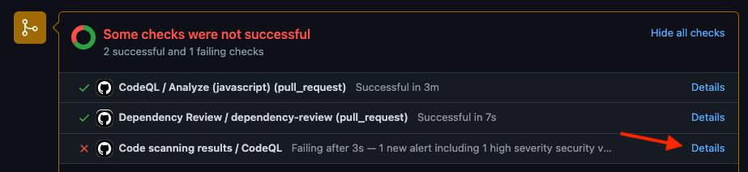

2. This will bring us to the **Checks** tab of the pull-request - it seems like we have a **Incomplete URL schema check** vulnerability with a **High** Severity. Let's click on *Details* again to find out more.

    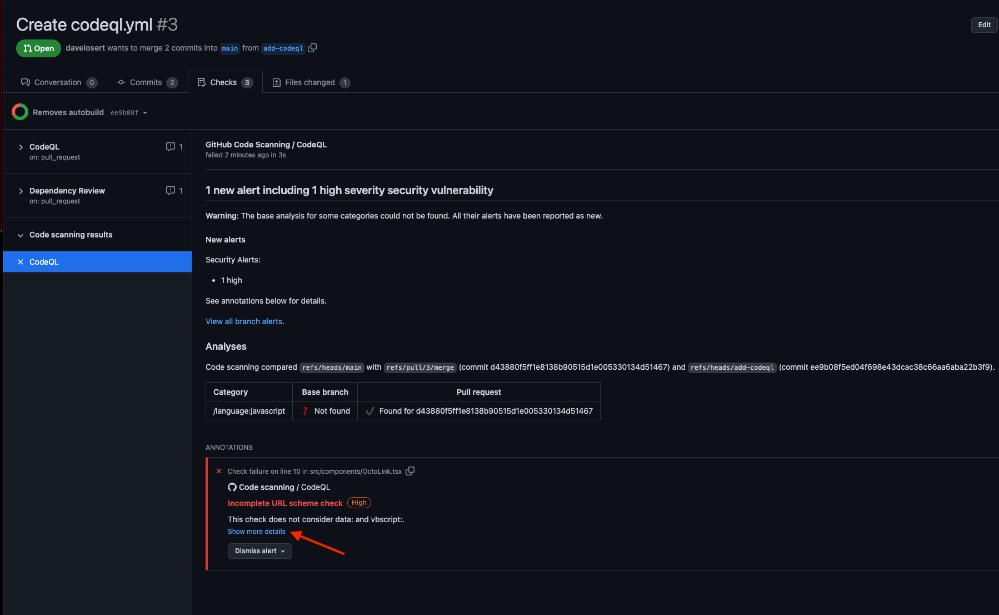

3. This brings us straight to the Code scanning alert page of the repository's **Security** tab. Here, we find all the details of vulnerability we just discovered: where it is in our code, what the vulnerability is, and even all about how to fix it (after clicking on **Show more**).

    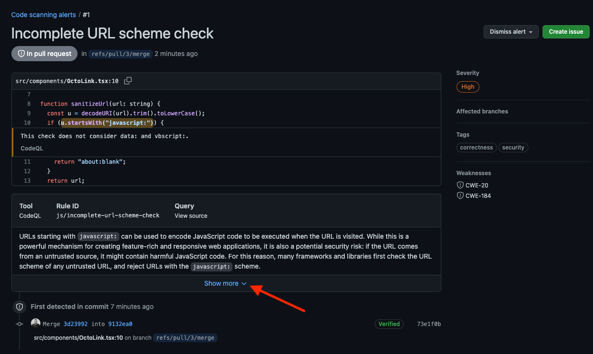

4. Okay, so it's time to fix this! You should have everything you need to do so yourself without further explanation. But if you need a hint, you can click on the button below to see the solution.

   <details>
   <summary>
   How to fix the vulnerability
   </summary>

   Change Line 10 in the file [`src/components/OctoLink.tsx`](../src/components/OctoLink.tsx#10) to the following and commit and push your changes afterwards:

   ```tsx
    if (u.startsWith("javascript:") || u.startsWith("data:") || u.startsWith("vbscript:")) {
      return "about:blank";
    }
   ```

   </details>

   After you made the changes and the CodeQL-Workflow ran again, the vulnerabilty will be gone and all checks on the pull request should pass.

   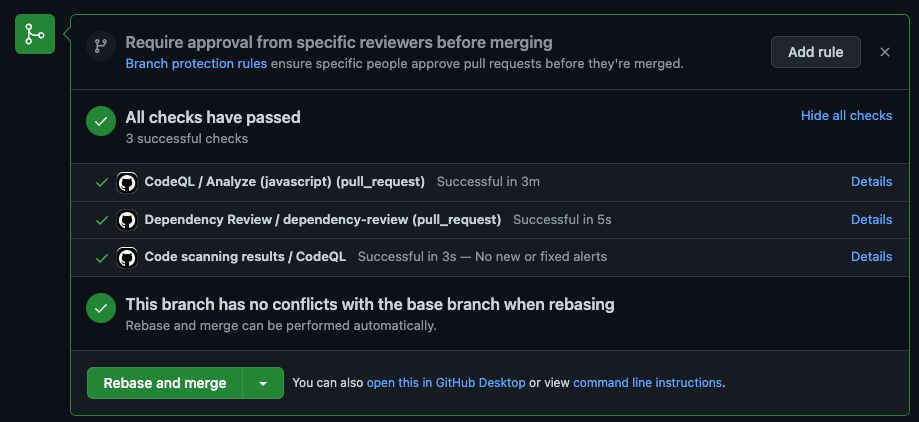

## (Optional) 3. Enforce both workflows to succeed before being able to merge a Pull Request

The same as in [Lab 2 - Step 3.4 (optional) Enforce a certain coverage threshold with Branch Protection Rules](002-basics-of-ci-with-actions.md#34-optional---enforce-a-certain-coverage-threshold-with-branch-proection-rules), you can enforce that the two workflows need to succeed before being allowed to merge a Pull Request. This is done by adding them to the `Required Status checks` of your Branch Protection rule for the `main` Branch.

This ensures that no one will be able to add any new vulnerabilities to your `main` Branch.

## Conclusion

And that's it! By working with GitHub Advanced security and Actions, we immediately found vulnerabilities both in our code and our supply chain, and were able to quickly remediate them - even long before they could become an actual problem!

In this lab you have learned how to:

- 👏 Activate the Dependency Graph and GitHub Advanced Security in your project
- 👏 Use the Dependency Review Action to scan your dependencies for vulnerabilities
- 👏 Use the CodeQL Action to scan your code for vulnerabilities

> **Note**
> What you learned in this lab was only the beginning of how GitHub Advanved Security can help you to ensure safety of your code. If you want to know more, you can read through the [Addendum - GitHub Advanced Security](./addendum-004-github-advanced-security.md)!

---

Next : [Launching the rocket - deployment!](/docs/005-deployment.md)
