# Part 5 - Deployment: Azure Self-serve

In a previous lab, you used GitHub Actions to package an application into a Docker image and publish that package to the GitHub Container registry. The next step in a classic continuous delivery process is to **deploy** the application.

In this lab, you will extend the workflow to deploy the container image to [Azure Container Apps](https://azure.microsoft.com/en-gb/products/container-apps/), a managed Kubernetes service in Azure.

Before deploying, you will learn how to authenticate to Azure using OIDC (OpenID Connect), an open and secure standard for authentication. OIDC eliminates the need to store secrets or credentials while still allowing secure authentication to Azure. OIDC can be used to [authenticate with many cloud providers](https://docs.github.com/en/enterprise-cloud@latest/actions/deployment/security-hardening-your-deployments/about-security-hardening-with-openid-connect), such as AWS, GCP, and others.

## 1 - Create a federated credential

In this step, you will need to log into your Azure account. You will then:

- Create a new service principal (SP).
- Create a federated credential to authenticate GitHub Actions workflows.
- Assign the `Contributor` role to the SP for a subscription.
- Record the SP information in your GitHub repository.

### 1.1 Create an Azure service principal (SP)

> **Note**: To perform this step, you will require at least `Contributor` access to your Azure Active Directory.

You will now create a service principal (SP) or app registration. This is like a "service account" to which you can assign roles and permissions.

1. Open the [Azure portal](https://portal.azure.com) in a browser and log in.
1. In the search bar at the top of the page, enter `active directory`, and then click on **Azure Active Directory**:

    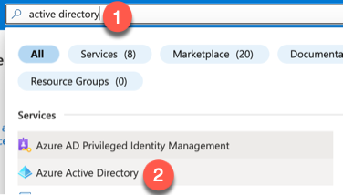

1. On the left menu, click on **App registrations**. Click on **New registration** to create a new SP:

    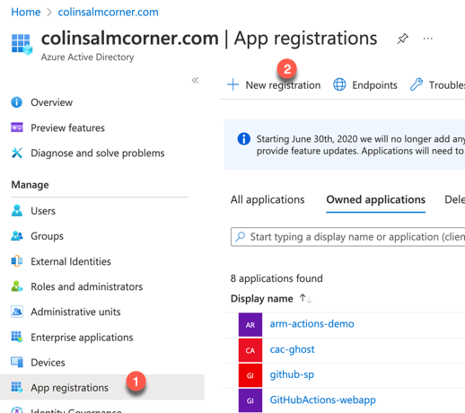

1. Enter a name for the SP, leave the rest of the fields as default, and click **Register**:

    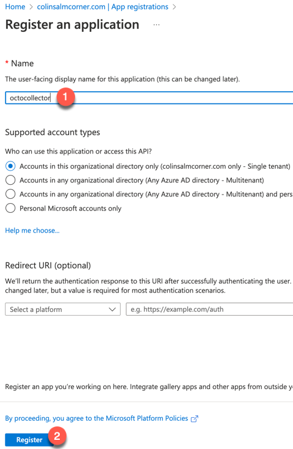

### 1.2 Create federated credentials for Actions from your repository

You will now create a federated (OIDC) credential. This credential will be authenticated only if the request comes from your repository and from an environment named `staging`. No other environments will be authenticated.

1. Click on the SP to navigate to its settings. Click on **Certificates & secrets**, then on **Federated credentials**, and finally, click the **Add credential** button:

    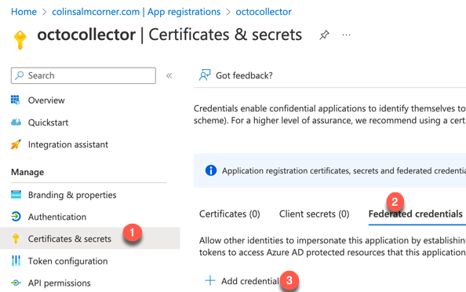

1. In **Federated credential scenario**, select **GitHub Actions deploying Azure resources**.
1. In **Organization**, enter your GitHub organization name, or if you are using a personal account, enter your handle (your GitHub username).
1. In **Repository**, enter the name of your repository.
1. In **Entity type**, select **Environment**.
1. Enter `staging` for the **GitHub environment name**.
1. In the **Credential details** section, enter `Staging` as the **Name**.
1. Click **Add** to create the credential:

    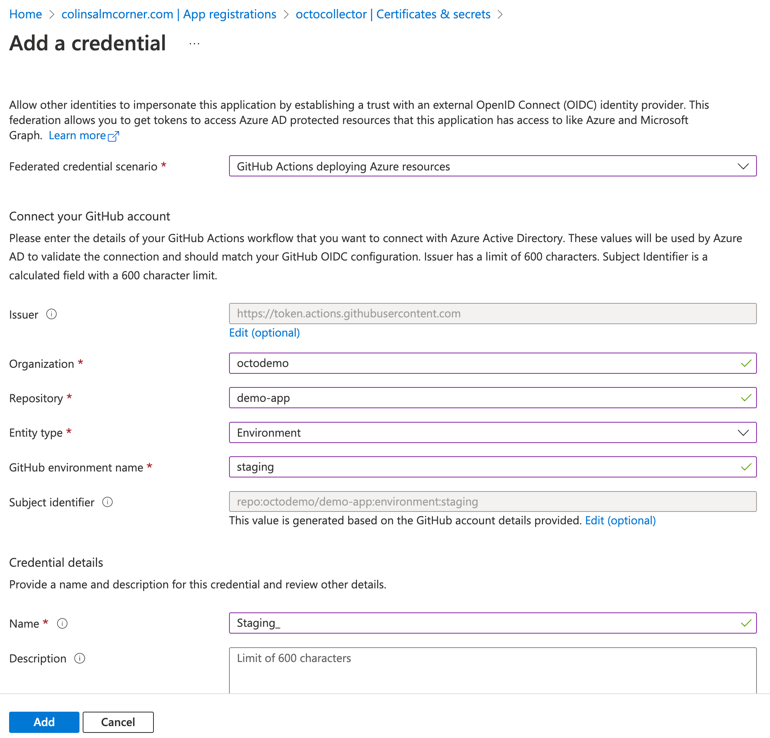

1. Now, click on **Overview** and write down the **Application (client) ID** and **Directory (tenant) ID** values:

    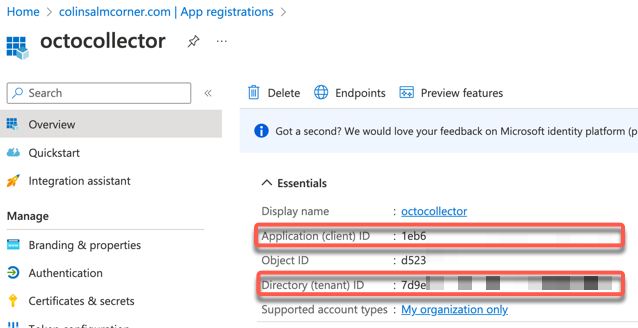

### 1.3 Assign roles to the SP

Now that you have an SP that can be used by Actions in your repository, targeting the `staging` environment, you must grant the SP permissions to create resources and resource groups in a subscription. For this workshop, you will assign the `Contributor` role to the SP.

1. In the search bar at the top of the page, enter `sub` and click on **Subscriptions**:

    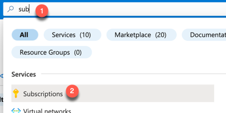

1. Click on the subscription to which you want to grant the SP permissions.
1. Click on **Access control (IAM)**, then click **Add** at the top menu and select **Add role assignment**:

    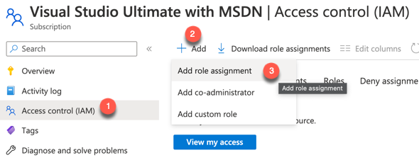

1. In the list of roles, select **Contributor** and click **Next**:

    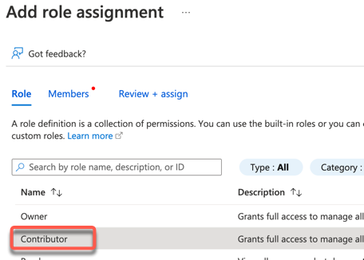

1. Click **Select members** and type in the name of your SP. Click on the SP in the list and then click **Select**:

    

1. In the overview, verify that everything is correct. Record the subscription ID for later and then click **Review + assign**:

    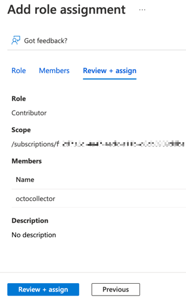

1. Confirm the role assignment is completed successfully.

### 1.4 Record IDs as secrets in your repository

You now have an SP that will enable your workflows to create, update, or delete resources in a subscription in Azure. Next, you will record the IDs required for the OIDC to function during a workflow, specifically the tenant ID, subscription ID, and the client ID (of the SP). Note that we are not storing any passwords or tokens!

Although the IDs are not strictly "secrets" as they cannot be used without a token or client secret, we will store them as secrets in the repository for convenience.

1. Navigate to your repository and click on the **Settings** tab. On the left menu, expand **Secrets** and click **Actions**. Then, click on **New repository secret**:

    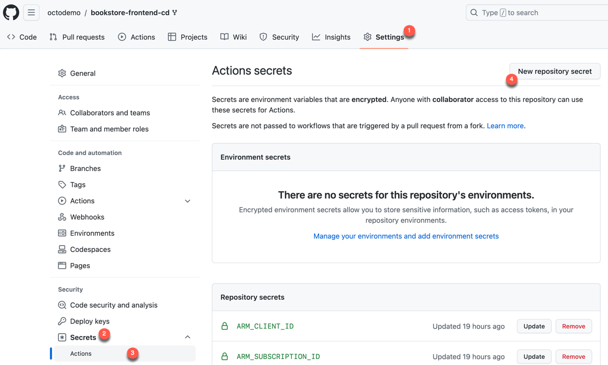

1. Enter the following secrets using the values you recorded earlier:

    | Name                 | Value               |
    | -------------------- | ------------------- |
    | `AZ_CLIENT_ID`       | The SP client ID    |
    | `AZ_SUBSCRIPTION_ID` | The subscription ID |
    | `AZ_TENANT_ID`       | The tenant ID       |

    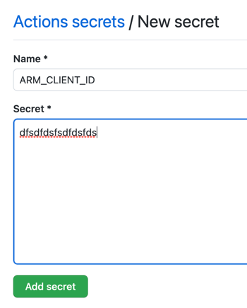

1. Upon completion, your secrets should look like the following:

    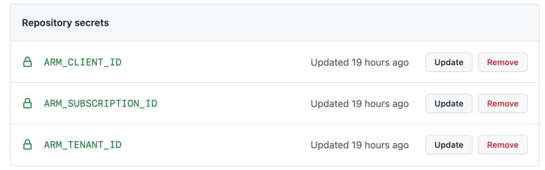

## 2 - Extend the workflow to deploy to staging

Time to put everything into action with a real deployment. In previous labs, you built the application and packaged it into a container image, which was then published to the GitHub Container Registry. To launch the application, you need to run this container image. Multiple methods exist to achieve this, such as through Azure Container Instances, Azure Web Apps for Linux, or within a Kubernetes cluster like Azure Kubernetes Services (AKS). Additionally, Azure offers a  managed Kubernetes service known as Azure Container Apps, capable of running container instances. For this workshop, you will deploy the container image to Azure Container Apps.

While it's possible to navigate to the Azure portal and create a container app, directing it to your packages in GitHub, a recommended best practice is to describe the resources using code, adopting Infrastructure as Code (IaC) principles. This project comes equipped with [Bicep](https://docs.microsoft.com/en-us/azure/azure-resource-manager/bicep/overview?tabs=bicep) scripts that detail the entire infrastructure. However, alternatives like Terraform can also be used for that purpose.

### 2.1 Utilizing Infrastructure as Code (IaC)

The Bicep files for deployment are in the [`/infra/container-app`](../infra/container-app/) folder in the repository, consisting of four distinct files:

| File                              | Description                                                                                                        |
| --------------------------------- | ------------------------------------------------------------------------------------------------------------------ |
| `container-app-environment.bicep` | Specifies the compute SKU for the container application                                                            |
| `container-app.bicep`             | Specifies the app itself, including which image(s) to run and whether or not the application is exposed externally |
| `law.bicep`                       | Log analytics workspace for diagnostics                                                                            |
| `main.bicep`                      | The main infrastructure file, which invokes the other files to create the full environment                         |

To set up the necessary infrastructure services and deploy the application, you will use the Azure command-line interface (`az cli`). Soon, you will integrate this step into the workflow. Before that, though, it's essential to make the package publicly accessible.

### 2.2 Publish the package

While it's generally not recommended to make container images public (unless you're working with open-source code), you will do so for this lab's simplicity. In a real-world scenario, the package would remain private, and you would need to provide Azure with the necessary registry credentials to access the container images.

1. Head to your repository's main page and click on **Packages**. Search for the relevant package and open it.

2. Click the **Package settings** button at the bottom right of the page:

    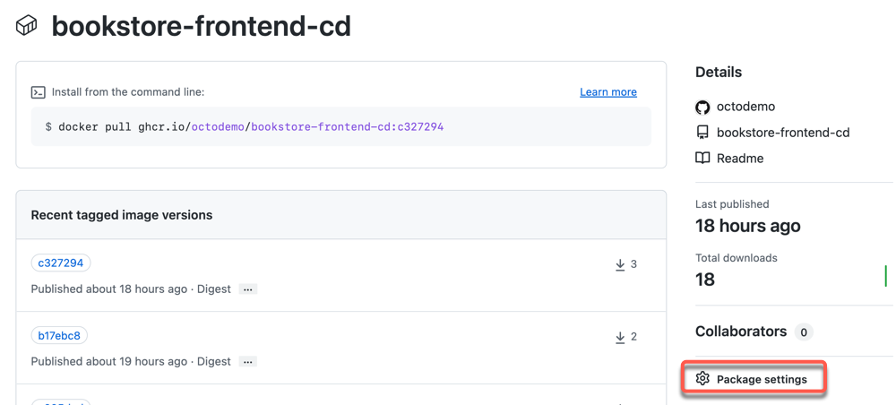

3. Scroll down to the bottom of the page and click on **Change visibility**:

    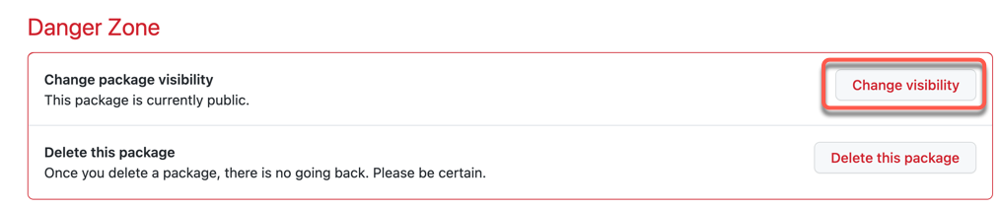

4. Change the visibility to **Public**, enter the repository's name, and hit the confirm button:

    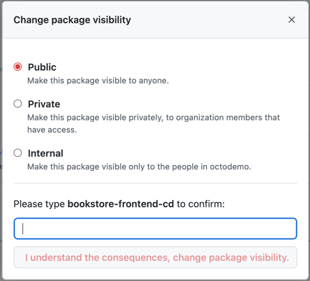

### 2.3 Integrate the deployment step into the workflow

It's now time to adjust the workflow, integrating automation for the application's deployment.

Open the `node.js.yml` file. Right after the `package-and-publish` job, insert the following job:

```yml
  staging:
    name: Deploy to Staging
    needs: [ package-and-publish ]
    runs-on: ubuntu-latest
    permissions:
      contents: read
      id-token: write
    environment:
      name: staging
      url: "https://${{ steps.deploy.outputs.fqdn }}"

    steps:
      - uses: actions/checkout@v2

      - name: Log into Azure using OIDC
        uses: azure/login@v1
        with:
          client-id: ${{ secrets.AZ_CLIENT_ID }}
          tenant-id: ${{ secrets.AZ_TENANT_ID }}
          subscription-id: ${{ secrets.AZ_SUBSCRIPTION_ID }}

      - name: Deploy resources
        uses: azure/arm-deploy@v1
        id: deploy
        with:
          scope: subscription
          region: eastus
          template: ./infra/container-app/main.bicep
          parameters: "containerImage=${{ needs.package-and-publish.outputs.container }} env=staging"
```

Keep in mind that you must set [explicit permissions](https://docs.github.com/en/actions/security-guides/automatic-token-authentication#permissions-for-the-github_token) for the `GITHUB_TOKEN`. This is because the `id-token: write` permission is necessary to request the OIDC JWT ID token.

```yml
    permissions:
      id-token: write
      contents: read
```

Finally, you must include an [`output`](https://docs.github.com/en/actions/using-jobs/defining-outputs-for-jobs) in your `package-and-publish` job to retrieve the container image name from the registry. This will be utilized during the Azure deployment to configure the container hosting.

```yml
     runs-on: ubuntu-latest
     outputs:
      container: ${{ steps.meta.outputs.tags }}
```

<details>
<summary>Click here to see what the full workflow file should look like</summary>

```yml
name: Node.js CI

on:
  push:
    branches: [ "main" ]
  pull_request:
    branches: [ "main" ]

jobs:
  build:
    name: "Build and Test"
    runs-on: ubuntu-latest
    permissions:
      contents: read
      pull-requests: write
    steps:
    - uses: actions/checkout@v3
    - name: Use Node.js
      uses: actions/setup-node@v3
      with:
        node-version: 16.x
        cache: 'npm'
    - run: npm ci
    - run: npm run build --if-present
    - run: npm test
    - name: 'Report Coverage'
      if: always()
      uses: davelosert/vitest-coverage-report-action@v2

  package-and-publish:
    needs:
      - build
    name: 🐳 Package & Publish
    runs-on: ubuntu-latest
    permissions:
      contents: read
      packages: write
    outputs:
      container: ${{ steps.meta.outputs.tags }}

    steps:
      - uses: actions/checkout@v3

      - name: Set up Docker Buildx
        uses: docker/setup-buildx-action@v2

      - name: Sign in to GitHub Container Registry
        uses: docker/login-action@v2
        with:
          username: ${{ github.actor }}
          password: ${{ secrets.GITHUB_TOKEN }}
          registry: ghcr.io

      - name: Generate docker metadata
        id: meta
        uses: docker/metadata-action@v4
        with:
          images: ghcr.io/${{ github.repository }}
          tags: |
            type=ref,event=tag
            type=ref,event=pr
            type=sha,event=branch,prefix=,suffix=,format=short
      - name: Build and Push Docker Image
        uses: docker/build-push-action@v2
        with:
          push: true
          tags: ${{ steps.meta.outputs.tags }}
          labels: ${{ steps.meta.outputs.labels }}
          cache-from: type=gha
          cache-to: type=gha,mode=max

  staging:
    name: Deploy to Staging
    needs: [ package-and-publish ]
    runs-on: ubuntu-latest
    permissions:
      contents: read
      id-token: write
    environment:
      name: staging
      url: "https://${{ steps.deploy.outputs.fqdn }}"

    steps:
      - uses: actions/checkout@v2

      - name: Log into Azure using OIDC
        uses: azure/login@v1
        with:
          client-id: ${{ secrets.AZ_CLIENT_ID }}
          tenant-id: ${{ secrets.AZ_TENANT_ID }}
          subscription-id: ${{ secrets.AZ_SUBSCRIPTION_ID }}

      - name: Deploy resources
        uses: azure/arm-deploy@v1
        id: deploy
        with:
          scope: subscription
          region: eastus
          template: ./infra/container-app/main.bicep
          parameters: "containerImage=${{ needs.package-and-publish.outputs.container }} env=staging"
```

</details>

The new job performs the following:

- Targets an environment named `staging`. This is crucial as the federated (OIDC) credential created earlier will only authorize this workflow if the `environment` matches.
- Determines the URL of the environment by examining the outputs of the `Deploy resources` step, which, in turn, reads the output parameter of the Bicep file.
- Checks out the code to gain access to the Infrastructure as Code files.
- Logs into Azure using the IDs saved as secrets - no password required!
- Invokes the `azure/arm-deploy` Action to deploy the application to Azure, supplying the region, main template, and additional parameters.

Commit the file changes to trigger the workflow to run.

### 2.4 Navigate to the staging environment

1. After the workflow run completes, you should see a link in the **Deploy to Staging** job in the workflow visualization graph:

    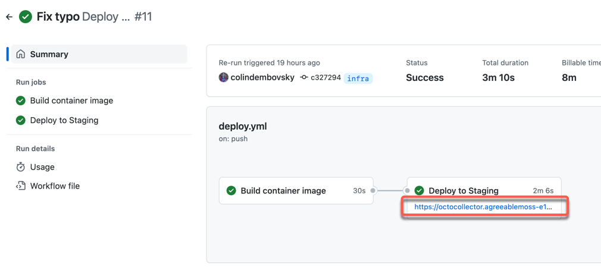

1. Click on the link to open the application running in Azure!

    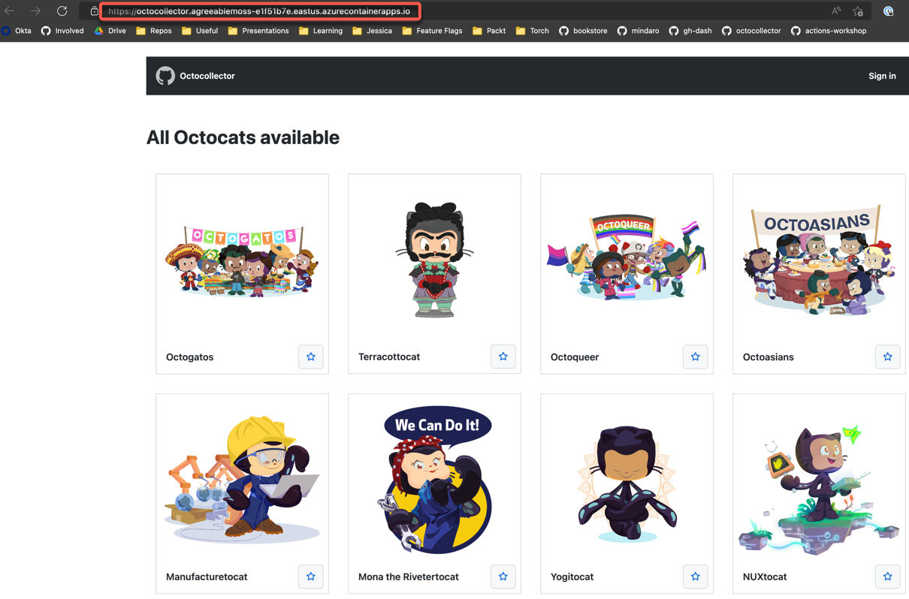

## 3 - Set up required approval for the staging environment

Now that the deployment is working, you might want to introduce a manual approval process.

1. Navigate to your repository **Settings**, then click on **Environments**, then select **staging**:

    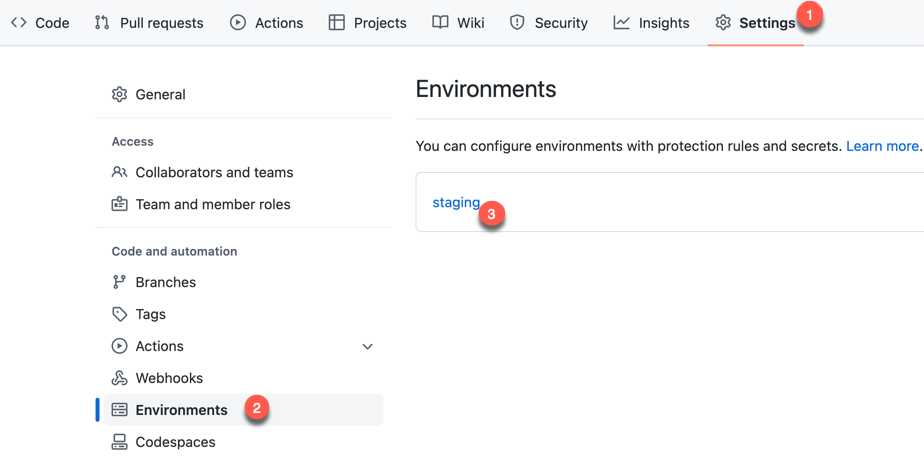

2. Ensure the **Required reviewers** option is selected, and add yourself as a reviewer.
3. Click **Save protection rules** to confirm your changes:

    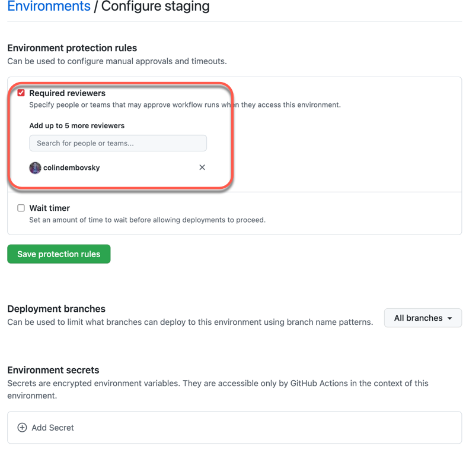

4. (Optional) Explore other environment options such as **Wait timer** and **Deployment branches**. The latter setting allows you to specify which branches can deploy to this environment.
5. The next time you push code, the workflow will pause at the **Deploy to Staging** job and wait for manual approval before executing the subsequent job steps.

## Cleaning Up

To remove the resources in Azure created during this lab, follow the steps below:

1. Navigate to the Azure portal.
2. Click on **Azure Active Directory** and search for the service principal you created, then delete it.
3. Locate the resource group, likely named something akin to `rg-octocollector-staging`, by clicking on **Resource groups**.
4. Confirm that this is the resource group containing your container app.
5. If everything looks correct, proceed to delete the resource group.

## Conclusion

In this lab, you have learned how to:

- 👏 Set up secure, secret-less authentication to Azure via OIDC.
- 👏 Employ Infrastructure as Code to simplify deployments.
- 👏 Set up an environment and designate approvers for best deployment practices.

This marks the conclusion of our workshop. We hope you found it enlightening and had a ton of fun along the way!
