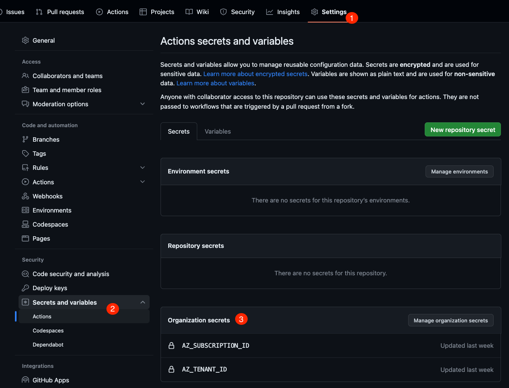

# Part 5 - Deployment: Azure Simple

In a previous lab, you used GitHub Actions to package an application into a Docker image and publish that package to the GitHub Container registry. The next step in a classic continuous delivery process is to **deploy** the application.

In this lab, you will extend the workflow to deploy the container image to [Azure Web Apps](https://azure.microsoft.com/en-us/products/app-service/web), a managed web application service in Azure that also supports container deployment.

You will learn how to easily authenticate against Azure using an action, use Actions variables to define configuration values for your actions, and establish manual deployment approvals for your environments.

> **Note**
> The Azure account you will use in this workshop is provided for you, so there's no need to create one yourself. Access is granted through organization secrets, which you will learn about in the first step of this lab.

## 1 - Actions variables and secrets

### 1.1 Create a new Actions variable

You have already learned how to utilize variables within a workflow. However, up to now, you have only used variables provided by GitHub itself. Now, let's learn how to add your own variables (and secrets) to define repository-specific configurations and other values that you might not want to hard-code into your workflow files.

1. Navigate to your repository's **Settings**, expand **Secrets and variables**, and select **Actions**.
    

2. Pause here and observe that there are already some organization secrets defined: `AZ_CLIENT_ID`, `AZ_SECRET`, `AZ_SUBSCRIPTION_ID`, and `AZ_TENANT_ID`. These secrets were created for you by your organization's administrator, allowing you to authenticate against Azure with a service principal (also known as "machine user") to execute your deployment. You can (and will) access these secrets from your workflow files under the `secrets` namespace (e.g., `secrets.AZ_CLIENT_ID`). Further details on the scopes of secrets and variables are provided below.

3. Navigate to the **Variables** tab  and click on **New repository variable**.

    

4. Name the variable `AZ_APP_NAME` and provide a value of your choice, preferably your repository's name (since the app name needs to be unique across all Azure web services, choose something distinctive). Click on **Add variable** once finished.
    

Now, you've created a variable that will be accessible from all workflows within this repository as `${{ vars.APP_NAME }}`. We will make use of this in our deployment workflow.

<details>
  <summary>(optional) Understand Azure and the provided secrets and variables</summary>

- `AZ_TENANT_ID`: An Azure tenant essentially represents the Azure account itself. This ID indicates the specific Azure account we will be logging into and deploying our app to later on.
- `AZ_SUBSCRIPTION_ID`: In Azure, a subscription functions as a billing unit, meaning that all associated resources will be billed based on the information linked to the subscription. Everything deployed to Azure must exist within a subscription, so you can view it as a top-level organizational mechanism.
- `AZ_CLIENT_ID` and `AZ_SECRET`: These are the credentials for the machine user (or "service principal" in Azure terminology) used for automated deployments. The "client ID" functions as the username, while the "secret" is the password. While there are other authentication methods supported by GitHub (e.g., passwordless through OIDC), they are beyond the scope of this workshop.
</details>

### 1.2 Scopes of secrets and variables

Secrets and variables can be defined across three distinct scopes:

1. **Environment**: Secrets and variables within this scope are only accessible for jobs that specify an `environment`. Environments can be protected, making this scope an excellent choice for restricting the use of these variables. Additionally, it can make workflows versatile for various environments like deployment targets by reusing identical variable names. You will delve deeper into environments in this lab.

2. **Repository**: Secrets and variables at this scope are available in all workflows of the repository. They are suitable for general secrets and variables you want to use or reuse across the repository.

3. **Organization**: Secrets and variables within this scope can be accessed in all workflows across all repositories of the organization. This is especially beneficial for defining secrets and variables used across multiple repositories, such as a shared deployment account, as seen in this workshop.

Once a job starts, all the scopes merge into the `secrets` namespace for secrets and the `vars` namespace for variables.

If two variables from different scopes share the same name, the one from the scope with the higher precedence is used. The precedence order is: **Environment** > **Repository** > **Organization**.
For instance, if you have a secret at the organization level named `SECRET` with the value `Organization`, and another with the same name in your repository with the value `Repository`, using `${{ secrets.SECRET }}` in your workflow will yield the value `Repository`.

## 2 - Extend the workflow to deploy to staging

Time to put everything into action with a real deployment. In previous labs, you built the application and packaged it into a container image, which was then published to the GitHub Container registry. To launch the application, you need to run this container image. Multiple methods exist to achieve this, such as through Azure Container Instances, Azure Web Apps for Linux, or within a Kubernetes cluster like Azure Kubernetes Services (AKS). Additionally, Azure offers a managed web app service known as Azure Web Apps, capable of running container instances. For this workshop, you will deploy the container image to Azure Web Apps.

A recommended best practice for deployments involves defining resources via code (Infrastructure as Code or IaC). This project comes equipped with [Bicep](https://docs.microsoft.com/en-us/azure/azure-resource-manager/bicep/overview?tabs=bicep) scripts that detail the entire infrastructure. However, alternatives like Terraform can also be used for that purpose.

### 2.1 Utilizing Infrastructure as Code (IaC)

The Bicep files for deployment are in the [`/infra/web-app`](../infra/web-app/) folder in the repository, consisting of two distinct files:

| File            | Description                                                                                                                   |
| --------------- | ----------------------------------------------------------------------------------------------------------------------------- |
| `main.bicep`    | The main infrastructure file, which creates an Azure resource group and invokes the other files to create the full environment |
| `web-app.bicep` | Specifies the app itself, as a web app for containers                                                                          |

To set up the necessary infrastructure services and deploy the application, you will use the Azure command-line interface (`az cli`). Soon, you will integrate this step into the workflow. Before that, though, it's essential to make the package publicly accessible.

### 2.2 Publish the package

While it's generally not recommended to make container images public (unless you're working with open-source code), you will do so for this lab's simplicity. In a real-world scenario, the package would remain private, and you would need to provide Azure with the necessary registry credentials to access the container images.

1. Head to your repository's main page and click on **Packages**. Search for the relevant package and open it.

2. Click the **Package settings** button at the bottom right of the page:

    

3. Scroll down to the bottom of the page and click on **Change visibility**:

    

4. Change the visibility to **Public**, enter the repository's name, and hit the confirm button:

    

### 2.3 Add the deployment step to workflow

It's now time to adjust the workflow, integrating automation for the application's deployment.

Open the `node.js.yml` file. Right after the `package-and-publish` job, insert the following job:

```yml
  staging:
    name: Deploy to Staging
    needs: [package-and-publish]
    runs-on: ubuntu-latest
    ## Only deploy after merges to the main branch, not on every PR
    if: github.event_name == 'push' && github.ref == 'refs/heads/main'
    permissions:
      contents: read
    environment:
      name: staging
      url: "${{ steps.deploy.outputs.url }}"

    steps:
      - uses: actions/checkout@v2

      - name: Log in to Azure using credentials
        uses: azure/login@v1
        with:
          creds: '{"clientId":"${{ secrets.AZ_CLIENT_ID }}","clientSecret":"${{ secrets.AZ_CLIENT_SECRET }}","subscriptionId":"${{ secrets.AZ_SUBSCRIPTION_ID }}","tenantId":"${{ secrets.AZ_TENANT_ID }}"}'

      - name: Deploy resources
        uses: azure/arm-deploy@v1
        id: deploy
        with:
          scope: subscription
          region: westeurope
          deploymentName: ${{ vars.APP_NAME }}-deployment
          template: ./infra/web-app/main.bicep
          parameters: "containerImage=${{ needs.package-and-publish.outputs.container }} actor=${{ github.actor }} appName=aw-${{ vars.APP_NAME }} repository=${{ github.repository }}"
```

Finally, you must include an [`output`](https://docs.github.com/en/actions/using-jobs/defining-outputs-for-jobs) in your `package-and-publish` job to retrieve the container image name from the registry. This will be utilized during the Azure deployment to configure the container hosting.

```yml
     runs-on: ubuntu-latest
     outputs:
       container: ${{ steps.meta.outputs.tags }}
```

<details>
<summary>Click here to see what the full workflow file should look like</summary>

```yml
name: Node.js CI

on:
  push:
    branches: ["main"]
  pull_request:
    branches: ["main"]

jobs:
  build:
    name: "Build and Test"
    runs-on: ubuntu-latest
    permissions:
      contents: read
      pull-requests: write
    steps:
      - uses: actions/checkout@v3
      - name: Use Node.js
        uses: actions/setup-node@v3
        with:
          node-version: 16.x
          cache: "npm"
      - run: npm ci
      - run: npm run build --if-present
      - run: npm test
      - name: "Report Coverage"
        if: always()
        uses: davelosert/vitest-coverage-report-action@v2

  package-and-publish:
    needs:
      - build
    name: 🐳 Package & Publish
    runs-on: ubuntu-latest
    permissions:
      contents: read
      packages: write
    outputs:
      container: ${{ steps.meta.outputs.tags }}

    steps:
      - uses: actions/checkout@v3

      - name: Set up Docker Buildx
        uses: docker/setup-buildx-action@v2

      - name: Sign in to GitHub Container Registry
        uses: docker/login-action@v2
        with:
          username: ${{ github.actor }}
          password: ${{ secrets.GITHUB_TOKEN }}
          registry: ghcr.io

      - name: Generate docker metadata
        id: meta
        uses: docker/metadata-action@v4
        with:
          images: ghcr.io/${{ github.repository }}
          tags: |
            type=ref,event=tag
            type=ref,event=pr
            type=sha,event=branch,prefix=,suffix=,format=short
      - name: Build and Push Docker Image
        uses: docker/build-push-action@v2
        with:
          push: true
          tags: ${{ steps.meta.outputs.tags }}
          labels: ${{ steps.meta.outputs.labels }}
          cache-from: type=gha
          cache-to: type=gha,mode=max

  staging:
    name: Deploy to Staging
    needs: [package-and-publish]
    runs-on: ubuntu-latest
    if: github.event_name == 'push' && github.ref == 'refs/heads/main'
    permissions:
      contents: read
      id-token: write
    environment:
      name: staging
      url: "${{ steps.deploy.outputs.url }}"

    steps:
      - uses: actions/checkout@v2

      - name: Log in to Azure using OIDC
        uses: azure/login@v1
        with:
          creds: '{"clientId":"${{ secrets.AZ_CLIENT_ID }}","clientSecret":"${{ secrets.AZ_CLIENT_SECRET }}","subscriptionId":"${{ secrets.AZ_SUBSCRIPTION_ID }}","tenantId":"${{ secrets.AZ_TENANT_ID }}"}'

      - name: Deploy resources
        uses: azure/arm-deploy@v1
        id: deploy
        with:
          scope: subscription
          region: westeurope
          deploymentName: ${{ vars.APP_NAME }}-deployment
          template: ./infra/main.bicep
          parameters: "containerImage=${{ needs.package-and-publish.outputs.container }} actor=${{ github.actor }} appName=aw-${{ vars.APP_NAME }} repository=${{ github.repository }}"
```

</details>

The new job performs the following tasks:

- Targets an environment named `staging`. This approach simplifies the process of understanding what is deployed and where. It also provides a direct link to the target within GitHub.
- Determines the URL of the environment by examining the outputs from the `Deploy resources` step. This step reads the output parameter of the Bicep file.
- Checks out the code to access the Infrastructure as Code files.
- Logs into Azure using the provided secrets from your organization.
- Invokes the `azure/arm-deploy` action to deploy the application to Azure. This is done by passing in the main template and additional parameters, including the `appName` you provided as an Actions variable.

Commit the file changes to trigger the workflow to run.

### 2.4 Navigate to the staging environment

1. After the workflow run completes, you should see a link in the **Deploy to Staging** job in the workflow visualization graph:

    

2. Click on the link to open the application running in Azure!

    

## 3 - Set up required approval for the staging environment

Now that the deployment is functioning, you might want to introduce a manual approval process.

1. Navigate to your repository **Settings**, then click on **Environments**, then select **staging**:

    

2. Ensure the **Required reviewers** option is selected, and add yourself as a reviewer.
3. Click **Save protection rules** to confirm your changes:

    

4. (Optional) Explore other environment options such as **Wait timers** and **Deployment branches**. The latter setting allows you to specify which branches can deploy to this environment.
5. The next time you push code, the workflow will pause at the **Deploy to Staging** job and wait for manual approval before executing the subsequent job steps.

## Conclusion

In this lab you learned:

- 👏 Utilize [Actions secrets](https://docs.github.com/en/actions/security-guides/encrypted-secrets) and [Actions variables](https://docs.github.com/en/actions/learn-github-actions/variables) to store sensitive information and/or configuration values, and understand their scopes.
- 👏 Employ Infrastructure as Code to simplify deployments.
- 👏 Use Actions to log into and deploy applications to Azure.
- 👏 Set up an environment and designate approvers for best deployment practices.

This marks the conclusion of our workshop. We hope you found it enlightening and had a ton of fun along the way!
