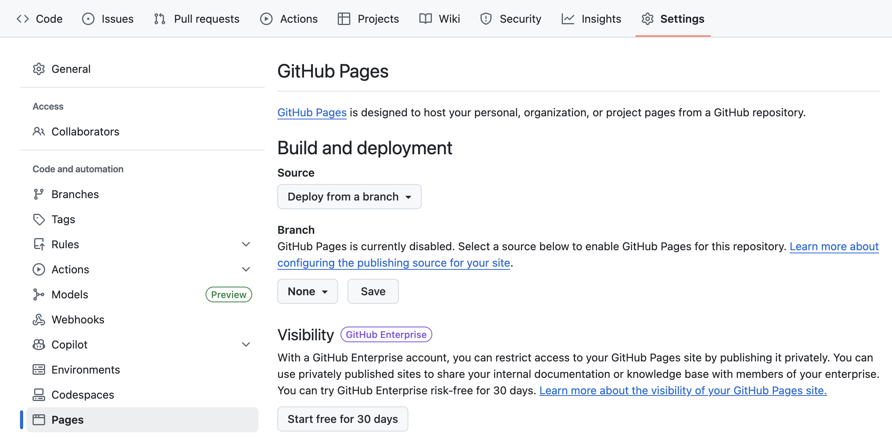
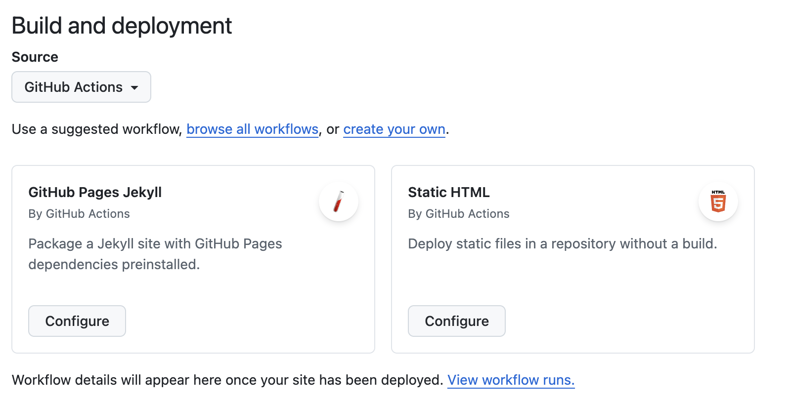
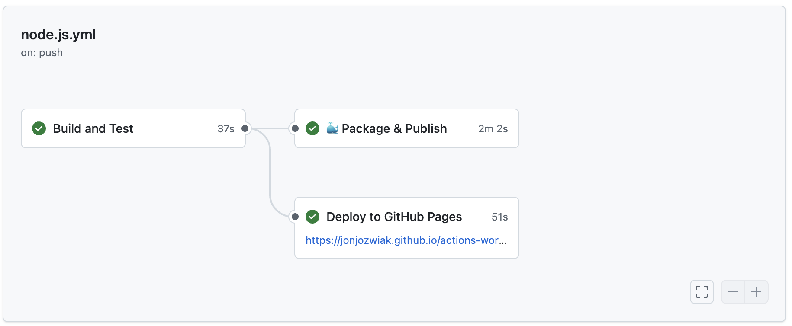

# Part 5 - Deployment: GitHub Pages

In a previous lab, you used GitHub Actions to package an application into a Docker image and publish that package to the GitHub Container registry. The next step in a classic continuous delivery process is to **deploy** the application.  [GitHub Pages](https://docs.github.com/en/pages) does NOT have the ability to deploy or work with Docker containers.  However, it can take a static website and publish it.  

In this lab, you will configure [GitHub Pages](https://docs.github.com/en/pages) to accept deployments from GitHub Actions.  GitHub Pages is GitHub's built-in static site hosting service that allows you to host static websites directly from your GitHub repository.  This is provided as an alternative to the Azure deployment lab in case an Azure account is not available.  While it can't host Docker images directly, you’ll configure GitHub Pages, build your app as a static site, and deploy it using GitHub Actions.

## 1 - Configure GitHub Pages for deployment

### 1.1 Enable GitHub Pages

> **Note**: To perform this step, you will require `Admin` or `Write` access to your repository.

You will now enable GitHub Pages for your repository and configure it to accept deployments from GitHub Actions workflows.

1. Navigate to your repository on GitHub and click on the **Settings** tab.

2. In the left sidebar, scroll down and click on **Pages**:

    

3. Under **Build and deployment**, change the **Source** from **Deploy from a branch** to **GitHub Actions**:

    

> **Note**: Do not select to configure a default workflow here.  You will create your own workflow in the next section.

4. GitHub Pages is now configured to accept deployments from Actions workflows.

### 1.2 Understanding GitHub Pages OIDC authentication

GitHub Pages uses OIDC (OpenID Connect) tokens for secure authentication. When you deploy to Pages using Actions, the workflow requests a short-lived OIDC token that proves the deployment request comes from an authorized workflow in your repository.  OIDC eliminates the need to store secrets or credentials while still allowing secure authentication to GitHub Pages. The same OIDC principles you learn here can be used to [authenticate with many cloud providers](https://docs.github.com/en/enterprise-cloud@latest/actions/deployment/security-hardening-your-deployments/about-security-hardening-with-openid-connect), such as AWS, GCP, and Azure.

This OIDC token:
- Is automatically generated during workflow execution
- Contains claims about the repository, workflow, and environment
- Is validated by GitHub Pages before allowing deployment
- Eliminates the need for long-lived secrets or personal access tokens

The OIDC authentication requires specific permissions in your workflow:
- `pages: write` - Allows creating GitHub Pages deployments
- `id-token: write` - Allows requesting the OIDC token for authentication

## 2 - Extend the workflow to deploy to GitHub Pages

Time to put everything into action with a real deployment. In previous labs, you built and tested the application using GitHub Actions. To make the application accessible to users, you need to deploy it. GitHub Pages provides an excellent platform for hosting static applications and websites directly from your repository.

For this workshop, you will deploy the built application to GitHub Pages, creating a website that updates automatically whenever you push changes to your main branch.  If you are using a free GitHub account the pages site must be public.  If you are using a paid plan such as GitHub Enterprise the site can remain private. 

### 2.1 Integrate the deployment step into the workflow


The application you've been building throughout this workshop is a frontend application that, when built, produces static files (HTML, CSS, JavaScript). These static files are perfect for deployment to GitHub Pages.

When you run `npm run build`, your application is compiled and bundled into static files that can be served by any web server. GitHub Pages excels at hosting these types of applications.

**GitHub Pages Base Path**: Since GitHub Pages serves your repository from a subdirectory (`https://username.github.io/repository-name/`), we need to configure the build process to generate the correct asset paths. We'll handle this in the workflow without modifying the main Vite configuration.

Open the `node.js.yml` file. Right after the `package-and-publish` job, insert the following job:

```yml
  deploy-pages:
    name: Deploy to GitHub Pages
    needs: [ build ]
    runs-on: ubuntu-latest
    permissions:
      contents: read
      pages: write
      id-token: write
    environment:
      name: github-pages
      url: ${{ steps.deployment.outputs.page_url }}

    steps:
      - uses: actions/checkout@v5

      - name: Setup Node.js
        uses: actions/setup-node@v4
        with:
          node-version: 22.x
          cache: 'npm'

      - name: Install dependencies
        run: npm ci

      - name: Build application for GitHub Pages
        run: npm run build -- --base=/${{ github.event.repository.name }}/ --mode=development

      - name: Setup Pages
        uses: actions/configure-pages@v5

      - name: Upload Pages artifact
        uses: actions/upload-pages-artifact@v4
        with:
          path: ./dist

      - name: Deploy to GitHub Pages
        id: deployment
        uses: actions/deploy-pages@v4
```

Notice the `Build application for GitHub Pages` step uses the `--base` command line option that automatically uses your repository name. This approach keeps your Vite config completely unchanged and applies the base path only during Pages deployment.

> **Note**: You could remove the Docker Package/Publish job if you are not using it for anything else.  However, we'll leave it in place for now running parallel with our deployment job.

Keep in mind that you must set [explicit permissions](https://docs.github.com/en/actions/security-guides/automatic-token-authentication#permissions-for-the-github_token) for the `GITHUB_TOKEN`. This is because both the `pages: write` and `id-token: write` permissions are necessary for GitHub Pages deployment with OIDC.

```yml
    permissions:
      contents: read
      pages: write
      id-token: write
```

<details>
<summary>Click here to see what the full workflow file should look like</summary>

```yml
name: Node.js CI

on:
  push:
    branches: [ "main" ]
  pull_request:
    branches: [ "main" ]
  workflow_dispatch:

jobs:
  build:
    name: "Build and Test"
    runs-on: ubuntu-latest
    permissions:
      contents: read
      pull-requests: write
    steps:
    - uses: actions/checkout@v5
    - name: Use Node.js
      uses: actions/setup-node@v4
      with:
        node-version: 22.x
        cache: 'npm'
    - run: npm ci
    - run: npm run build --if-present
    - run: npm test
    - name: 'Report Coverage'
      if: always()
      uses: davelosert/vitest-coverage-report-action@v2

  package-and-publish:
    needs:
      - build
    name: 🐳 Package & Publish
    runs-on: ubuntu-latest
    permissions:
      contents: read
      packages: write
    outputs:
      container: ${{ steps.meta.outputs.tags }}

    steps:
      - uses: actions/checkout@v5

      - name: Set up Docker Buildx
        uses: docker/setup-buildx-action@v3

      - name: Sign in to GitHub Container Registry
        uses: docker/login-action@v3
        with:
          username: ${{ github.actor }}
          password: ${{ secrets.GITHUB_TOKEN }}
          registry: ghcr.io

      - name: Generate docker metadata
        id: meta
        uses: docker/metadata-action@v5
        with:
          images: ghcr.io/${{ github.repository }}
          tags: |
            type=ref,event=tag
            type=ref,event=pr
            type=sha,event=branch,prefix=,suffix=,format=short
      - name: Build and Push Docker Image
        uses: docker/build-push-action@v6
        with:
          push: true
          tags: ${{ steps.meta.outputs.tags }}
          labels: ${{ steps.meta.outputs.labels }}
          cache-from: type=gha
          cache-to: type=gha,mode=max

  deploy-pages:
    name: Deploy to GitHub Pages
    needs: [ build ]
    runs-on: ubuntu-latest
    permissions:
      contents: read
      pages: write
      id-token: write
    environment:
      name: github-pages
      url: ${{ steps.deployment.outputs.page_url }}

    steps:
      - uses: actions/checkout@v5

      - name: Setup Node.js
        uses: actions/setup-node@v4
        with:
          node-version: 22.x
          cache: 'npm'

      - name: Install dependencies
        run: npm ci

      - name: Build application for GitHub Pages
        run: npm run build -- --base=/${{ github.event.repository.name }}/ --mode=development

      - name: Setup Pages
        uses: actions/configure-pages@v5

      - name: Upload Pages artifact
        uses: actions/upload-pages-artifact@v3
        with:
          path: ./dist

      - name: Deploy to GitHub Pages
        id: deployment
        uses: actions/deploy-pages@v4
```

</details>

The new job performs the following:

- Targets an environment named `github-pages`. This is the standard environment name for GitHub Pages deployments.
- Determines the URL of the deployed site by examining the outputs of the `Deploy to GitHub Pages` step.
- Builds the application to create the static files needed for deployment.
- Uses the `actions/configure-pages@v5` action to set up Pages configuration.
- Uploads the built application as a Pages artifact using `actions/upload-pages-artifact@v3`.
- Deploys to GitHub Pages using OIDC authentication - no secrets required!

Commit the file changes to trigger the workflow to run.

### 2.2 Navigate to your deployed application

1. After the workflow run completes, you should see a link in the **Deploy to GitHub Pages** job in the workflow visualization graph:

    

2. Click on the link to open your application running on GitHub Pages!

    

3. Your application is now live at a URL like: `https://[username].github.io/[repository-name]`

### 2.3 Inspect the environment configuration

After you have successfully deployed your application, you can inspect the environment configuration for `github-pages`.  

1. Navigate to your repository **Settings**, then click on **Environments**, then select **github-pages**. 

2. Notice that the environment has been created automatically when the workflow ran.  Here if you wanted to enable protection rules such as requiring a reviewer before deployment you could do that.  

## Cleaning Up

GitHub Pages deployments don't create persistent infrastructure that needs cleanup, but here's how to clean up if needed:

1. To disable GitHub Pages:
   - Navigate to your repository **Settings** → **Pages**
   - Change the source back to **None** to disable Pages
2. To remove the environment:
   - Go to **Settings** → **Environments**
   - Click on **github-pages** and then **Delete environment**
3. Your static site will no longer be accessible, but all your code and workflow configurations remain intact.

## Conclusion

In this lab, you have learned how to:

- Set up secure, secret-less authentication to GitHub Pages via OIDC.
- Deploy a static application using GitHub Actions workflows.
- Set up an environment and designate approvers for best deployment practices.

This deployment approach provides a simple yet powerful way to host your applications, with automatic updates whenever you push changes to your repository. The OIDC authentication patterns you've learned here apply to many other deployment targets and cloud providers as well!
